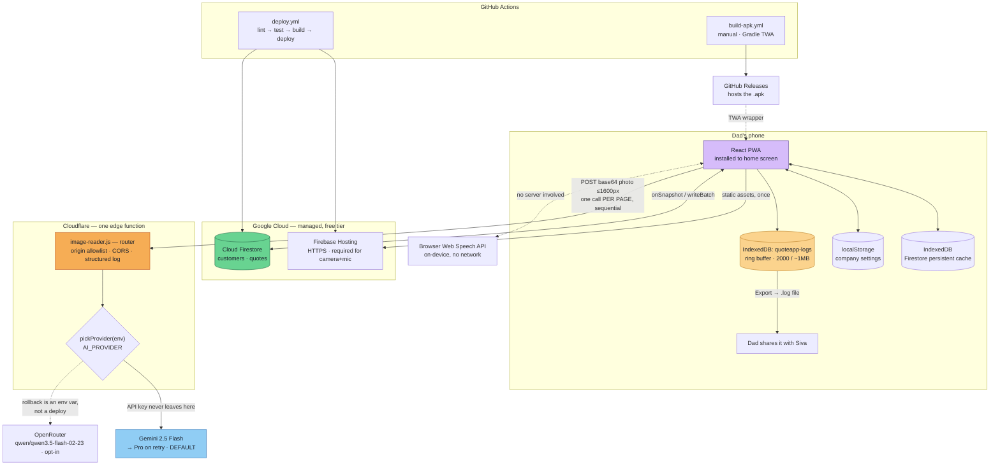
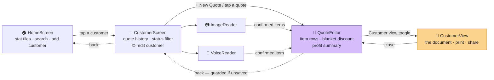
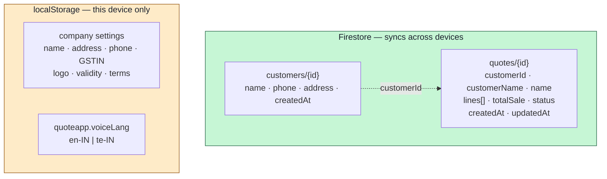
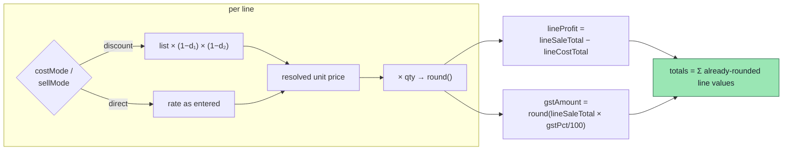
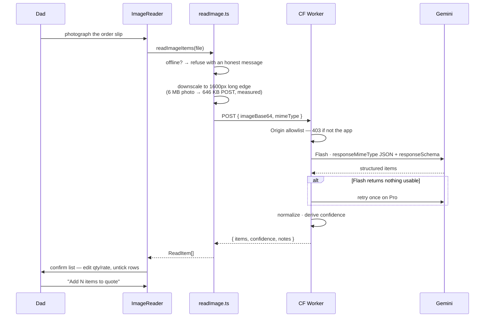
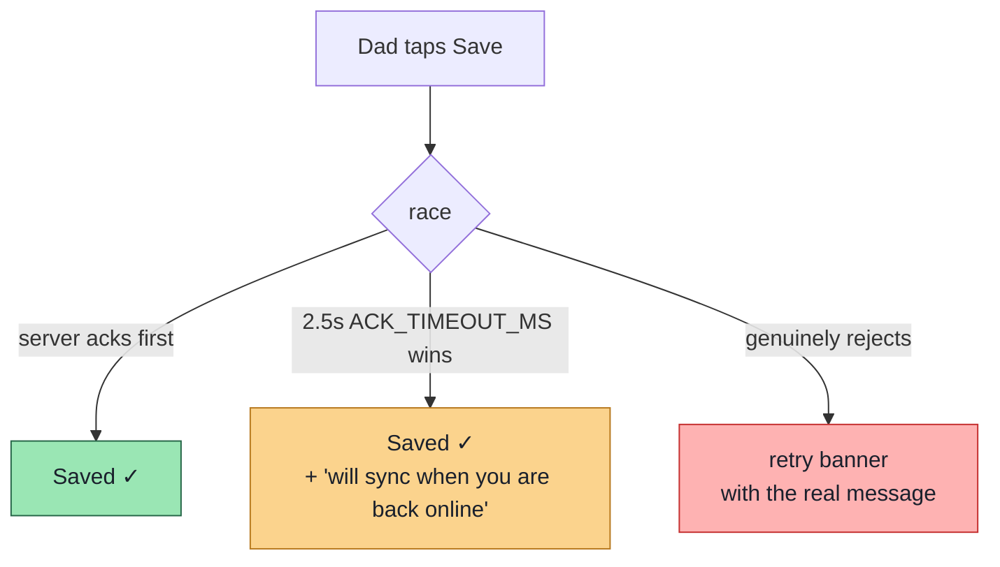

<div align="center">

# Quotation App — End-to-End Design

**One React app · one managed database · one 200-line edge function.**
No servers to run, no containers, no Python, entirely on free tiers.

`React 19` · `TypeScript` · `Vite 8` · `Firestore` · `Cloudflare Workers` · `Gemini 2.5` · `Vitest`

*Written 2026-08-08 on `feature/Vision_Draft`; §12 rewritten and §§15–17 merged
in from a separate architecture doc on 2026-08-20. Companion to
[CLAUDE.md](CLAUDE.md) (the plan and its history) and
[HUMAN-TASKS.md](HUMAN-TASKS.md) (work blocked on a person).
**This is the only architecture document — if you are about to start a second
one, add a section here instead.**
Where this file and `git` disagree, `git` is right.*

</div>

---

## Contents

| | |
|---|---|
| [1. What the app is for](#1-what-the-app-is-for) | The domain, in one screen |
| [2. System at a glance](#2-system-at-a-glance) | Every moving part |
| [3. What counts as "the backend"](#3-what-counts-as-the-backend) | **Read before looking for a server** |
| [4. Screen flow](#4-screen-flow) | Four screens, one path |
| [5. Data model](#5-data-model) | What lives where, and why |
| [6. The calc engine](#6-the-calc-engine) | The money maths |
| [7. Three ways items get in](#7-three-ways-items-get-in) | Hand, photo, voice |
| [8. Trust and offline](#8-trust-and-offline) | Why nothing hangs |
| [9. The customer document](#9-the-customer-document) | The thing Dad sends |
| [10. Guarantees the compiler enforces](#10-guarantees-the-compiler-enforces) | Not conventions |
| [11. Deploy topology](#11-deploy-topology) | Two independent pipelines |
| [12. Test topology](#12-test-topology) | What is covered, what is not |
| [13. Leftover design](#13-leftover-design) | **Swept from every plan and memory** |
| [14. Runbook](#14-runbook) | **Launch + connectivity commands** |
| [15. Repo map](#15-repo-map--every-file-and-what-it-is-for) | Every file, annotated with intent |
| [16. How it got here](#16-how-it-got-here--v1--now) | v1 → now, and what forced each change |
| [17. Stack](#17-stack--and-what-each-choice-stands-in-for) | Each choice, and what it stands in for |

---

## 1. What the app is for

Dad supplies electrical materials. He takes an order, buys from a vendor,
supplies the customer, and his profit is the **gap between the vendor's discount
and the rate he quotes**. This app does that arithmetic correctly, on a phone, in
the field, and prints a customer-facing document that never leaks his cost or his
margin.

Three rules fall out of the domain and drive everything below:

| Rule | Consequence in the code |
|---|---|
| Discounts **compound**, never add | `list × (1−d₁) × (1−d₂) × …`, not `list × (1−d₁−d₂)` |
| GST is **pass-through** | It prints on the document and never enters profit |
| Cost is **private** | The customer view has no cost field to leak — enforced by the type system |

> **Scope posture.** Roughly two users, one family business. Not a product, not
> multi-tenant, no growth curve. The real failure modes are *Dad losing a quote*
> and *Dad reading a wrong number* — not attackers or traffic. Every design call
> below is weighted by value to one man on his phone, and prefers the fewest
> moving parts that work.

---

## 2. System at a glance



**The whole system is four things:** a static React bundle, a managed database,
one edge function, and two CI workflows. There is nothing else to operate.

**Two things on that diagram are not live yet.** The provider split and
everything else in `cf-worker/` deploys **by hand** — the box drawn above is the
committed code, and production is still running a build that predates PI-3. The
log ring buffer *is* live in the client the moment `main` deploys.

---

## 3. What counts as "the backend"

This app has **no application server**. Nothing to `run`, no process to keep
alive, no port to bind in production. "Backend" here means two unrelated things:

| # | What | Where it runs | Launch it locally? | Language |
|---|---|---|---|---|
| 1 | **Cloud Firestore** | Google's managed service | **No — it is cloud-only.** Connect straight to the live project | — |
| 2 | **Image-reader Worker** | Cloudflare edge | **Yes** — `npx wrangler dev` on `:8787`. The only local server | JavaScript |

> ### ⚠️ There is no FastAPI, no uvicorn, and no Python here
>
> If you came looking for `uvicorn main:app --reload`, it does not exist and
> should not be added. Verified on 2026-08-08: no `*.py`, no
> `requirements.txt`, no `pyproject.toml`, no `main.py` anywhere in the tree.
> `package.json` is the **only** manifest.
>
> A `.quoteapp/` virtualenv appeared once as a stray and was deleted in PI-4. If
> it comes back, delete it again.
>
> **Why there is no Python tier at all:** the two jobs a backend would do are
> already done without one. Persistence is Firestore, which the browser SDK talks
> to directly — an API layer in front of it would add a deploy target, a cold
> start, and a second place for bugs, while *removing* the offline queue that
> PI-1 depends on. Secret-keeping is the Worker, which exists for exactly one
> reason: the Gemini API key must never reach the browser. That is ~200 lines at
> the edge, not a service.
>
> So the honest answer to "check UI + backend connectivity" is **two independent
> checks** — Firestore reads/writes, and the Worker's `POST`. §14 has both.

---

## 4. Screen flow



[`AppRouter.tsx`](src/AppRouter.tsx) is the view manager — a discriminated union
in `useState`, no router library. Four screens do not justify one.

> **One sharp edge, worth knowing.** `AppRouter` holds the selected customer as a
> **snapshot** and nothing re-reads it. That is why editing a customer calls
> `onCustomerChange` back up to the router: without it, Dad would save a
> corrected phone number and watch the screen keep showing the old one. It is
> also *why the correction is retroactive* — `QuoteEditor` reads the customer
> from that same object, not from the quote's denormalized copy, so fixing a
> phone number fixes quotations already saved.

---

## 5. Data model

Three stores, deliberately split by *who needs it where*:



| Decision | Why |
|---|---|
| Quotes and customers in **Firestore** | They must follow Dad between his phone and a laptop, and survive a lost device |
| Company settings in **localStorage** | One-time setup, one business, includes a base64 logo. Syncing it buys nothing and a logo in Firestore costs reads |
| `lines[]` embedded in the quote doc | A quote is always read whole. A subcollection would mean N reads to show one quote |
| `customerName` **denormalized** onto the quote | Written at save time for list display without a join |
| `totalSale` **denormalized** | The home tiles and quote list sum many quotes without parsing every `lines[]` |
| No composite index | `useQuotes` issues one equality filter and sorts client-side. The stale `customerId + updatedAt` index was dropped in PI-4.5 |

**Legacy tolerance is a requirement, not politeness.** Quotes written before
`status` existed read as `undefined`, so every read goes through
`quoteStatus(q)`, which falls back to `"draft"`. `customerPatch` reads stored
fields as `(stored[key] ?? "")` for the same reason. Both are tested.

> **Known consequence of denormalizing `totalSale` — bug #9.** A quote saved
> *before* PI-2 with a fractional quantity stored a truncated total. The editor
> and the document always recompute from `lines`, so both read correctly; the
> list row and home tiles read the stored field and stay stale until the quote is
> opened and saved once. Self-healing, and only ever toward correctness.

---

## 6. The calc engine

[`calc/engine.ts`](src/calc/engine.ts) is **pure** — no UI, no network, no
Firestore. That is what makes 31 tests able to pin the money down.



```
lineCostTotal = round(resolvedCost × qty)
lineSaleTotal = round(resolvedSell × qty)
lineProfit    = lineSaleTotal − lineCostTotal      ← pre-GST, always
gstAmount     = round(lineSaleTotal × gstPct/100)
```

**Rounding per line, then summing, is a correctness requirement — not
cosmetics.** Dad's numbers must match a hand-checked line-by-line total, so the
engine sums values that are *already rounded* rather than rounding a raw sum.
Worked example from the fixtures: `17835 × (1−0.647) × (1−0.02) = 6169.84`.

Quantities are parsed by one tested `parseQty` — wire and cable sell by the
metre, so `"2.5"` must stay `2.5`. This replaced `parseInt(l.qty)` in five
places, which silently billed 2.5 m as 2 m (bug #5).

> **Open design question, needs a real quote from Dad.** The *cost-side* rounding
> **sequence** is tunable and unconfirmed. Sell-side numbers match exactly on
> clean direct rates. Do not burn time forcing cost totals to the rupee until
> Siva confirms the sequence against a real vendor quote.

---

## 7. Three ways items get in

Every automated path ends at a **confirmation list**. Nothing is ever added to a
quote without Dad seeing it first.



| Path | Engine | Cost | Notes |
|---|---|---|---|
| **By hand** | — | — | Collapsed rows + bottom-sheet editor |
| **Photo** | Gemini 2.5 Flash → Pro on retry | ~free at this volume | Key lives in the Worker, never the browser |
| **Voice** | Browser Web Speech API | free | **On-device.** No server, no key, works in `en-IN` and `te-IN` |

**Design notes that cost real debugging to learn:**

- **Schema-constrained output, not prose parsing.** The Worker asks for
  `responseMimeType: "application/json"` plus a `responseSchema`. This deleted
  four separate parse-failure branches that used to hunt a ```` ```json ```` fence
  out of free text.
- **Escalate on retry only.** Pro runs *only* when Flash returned nothing usable,
  so the average read stays cheap and a bad read still gets a proper try.
- **`confidence` is derived, not asserted.** `"full"` only when every row has a
  qty *and* a rate; `"partial"` when something needs typing; `"low"` when nothing
  was read.
- **A missing rate stays `null`.** It must reach the confirm list as an empty
  field, not as a line priced at ₹0. The confirm list warns: *"N items still need
  a qty or rate."*
- **Qty and rate fields hold text, not numbers.** A number input re-parsed on
  every keystroke gets its value stomped mid-edit — typing `2.5` produced **25**.
  They now hold the in-progress string and parse once at commit.
- **The voice parser reads quantity-first.** `"6 wire 1.5sq rate 1650"` → qty 6,
  name `wire 1.5sq`. In this domain `1.5 sq` and `2.5 sq` are *item names*.
  Teaching that regex decimals would turn a correct parse into a wrong one.

---

## 8. Trust and offline

PI-1's theme: **Dad must never lose work and never see a wrong number.** The
design problem is subtler than "cache the data".



> **The trap: Firestore resolves a write promise only on _server_ ack.** Offline
> that promise **never settles**, so simply `await`-ing it hangs the Save button
> forever *even with persistence enabled* — the original bug wearing a new hat.

| Mechanism | What it buys |
|---|---|
| `persistentLocalCache` + multi-tab manager | Reads and queued writes survive no signal |
| `ACK_TIMEOUT_MS = 2500` race in `saveQuote` | The button always resolves; `queued: true` means "cache has it, server has not confirmed" |
| Client-minted `doc()` id, not `addDoc` | A quote created with no signal still gets a stable id |
| `seedNextId(lines, current)` | Reopened quotes cannot mint a duplicate line id — that collision made edits patch two rows and delete the wrong one |
| Unsaved-changes dialog + `beforeunload` | Back or swipe-away cannot silently discard edits |
| App-wide `ErrorBoundary` | A render throw gives a recovery card, not a white screen |
| "No cost" chip + profit caveat | Imported lines resolve cost to ₹0, which would report the whole sale as margin |

**The same lesson, reused correctly.** Editing a customer deliberately does
**not** `await` its write and needs **no** ack race — because it makes no promise
worth racing. Nothing there tells Dad his data is safe; the sheet closes and the
screen shows what he typed, while the cache replays the write. A genuine
rejection reverts the screen and says so, so the UI never displays a value
Firestore refused.

---

## 9. The customer document

[`CustomerView.tsx`](src/CustomerView.tsx) is a **quotation**, not a price list:
a To block from the customer record, a quote number derived from `createdAt`
(`Q-260806-1423`), the date, an optional subject, validity and terms from company
settings, `₹` on every amount — and every field hides when empty, so a customer
with no address on file still prints cleanly.

| Decision | Reason |
|---|---|
| Quote number **derived** from `createdAt`, not sequential | A counter needs a write that can fail offline — on an app whose whole premise is that nothing fails offline. Derived cannot collide and never changes |
| `createdAt` minted when the **editor opens** | A PDF shared *before* the first save carries the same number the saved quote ends up with |
| `.cv-doc` pinned to **`width: 760px`** | See the callout below |
| Column toggles (Qty, List, Discount, Rate, Amount) | Dad decides how much pricing structure to reveal |
| PDF rasterised via html2canvas | Telugu item names and the logo reproduce exactly |

> ### The document does not reflow, and that is deliberate (bug #8)
>
> `sharePdf` rasterises `.cv-doc` at whatever width it happens to be rendered,
> so a *responsive* document meant **the file a customer received depended on the
> screen it was shared from** — on a phone the table overflowed and the Amount
> column was cut out of the PDF entirely.
>
> Fixed width costs a sideways scroll in the phone preview. That is the right
> trade: a preview that fits the screen but misrepresents the output is worse
> than one Dad has to nudge. **Do not make it responsive again.** If the preview
> must fit, *scale* it with `transform` — and check what html2canvas does with
> the transform before trusting it.

---

## 10. Guarantees the compiler enforces

Not conventions — things that fail the build if broken.

| Guarantee | How |
|---|---|
| **Cost and profit can never reach the customer view** | `CustomerView` takes `CustomerLine[]`, whose `result` is `Pick<LineResult, "resolvedSell" \| "lineSaleTotal">`. There is **no cost field to leak.** CSS is not involved |
| A customer edit cannot touch `id` or `createdAt` | `CustomerEdits = Partial<Pick<Customer, "name" \| "phone" \| "address">>` |
| A blank customer name cannot be written | `customerPatch` returns `null`; the sheet also disables Save |
| A no-op edit writes nothing | `customerPatch` trims, compares, and returns `null` when nothing changed |
| Quote status is closed | `QuoteStatus` union + `quoteStatus()` fallback for pre-field docs |

Design tokens are the same idea for visuals: every colour, space, radius, type
size and shadow lives as a CSS custom property in
[`index.css`](src/index.css). Screens consume tokens — **never** hardcoded hex or
px. Money uses `.tnum` so digit columns align; touch targets are `var(--tap)` =
48px.

---

## 11. Deploy topology

**Two pipelines that do not wait for each other.** Confusing them wastes hours.

```mermaid
flowchart TB
    subgraph a["Pipeline A — the web app"]
        pushm["push to main"] --> gh["GitHub Actions deploy.yml<br/>Node 22"]
        gh --> l["npm run lint"] --> t["npm test"] --> b["npm run build"] --> fb["Firebase Hosting<br/>+ firestore:rules"]
    end
    subgraph b2["Pipeline B — the Worker, by hand"]
        dev["cf-worker/ on any branch"] --> wr["npx wrangler deploy"] --> live["ONE live URL<br/>every build already points at"]
    end
    subgraph c["Pipeline C — the APK, manual"]
        wd["Actions → Run workflow"] --> grad["Gradle TWA<br/>KEYSTORE_PASSWORD from secret"] --> relz["attach to a GitHub Release"]
    end
    style live fill:#f6ad55,stroke:#c05621,color:#1a202c
    style fb fill:#68d391,stroke:#276749,color:#1a202c
```



| | Web app | Worker | APK |
|---|---|---|---|
| **Trigger** | push to `main` | `npx wrangler deploy`, by hand | manual `workflow_dispatch` |
| **Gated on `main`?** | **Yes** | **No** | No |
| **Reaches Dad** | on the next push to `main` | **immediately, from any branch** | when he installs it |
| **Needs a login** | `FIREBASE_TOKEN` secret | Cloudflare OAuth (a human) | `KEYSTORE_PASSWORD` secret |

> **The Worker asymmetry, stated once so it is not re-learned.** `cf-worker/` is
> deployed by hand against one live URL that every build of the app already
> points at. So worker code **committed** on a branch is *not* live, and worker
> code **deployed** from a branch *is*. Keep those apart.
>
> Never `wrangler deploy --temporary` — `whoami` suggests it when you are logged
> out and it deploys to a *preview account*, giving you a green deploy that
> changes nothing for Dad.

**Version numbers are two things, not a conflict.** `APP_VERSION` (the web app,
redeployed on every push to `main`) legitimately runs ahead of `APK_VERSION` (the
newest Release with an APK attached), because the APK is only a TWA wrapper
around the hosted site. `APK_URL` is built *from* `APK_VERSION`, so the tag and
the link cannot disagree.

The APK lives on GitHub Releases because **Firebase Spark blocks hosting
executables**.

---

## 12. Test topology

*Rewritten 2026-08-20. This section described 215 tests in a single node
project and said component tests were impossible — all three facts were
overtaken by PI-12. Run `npm test` for the authoritative numbers.*

```
npm test  →  327 tests · 21 files · TWO Vitest projects
│
├── project "unit"   environment: node    286 tests / 16 files
│   │   glob **/*.test.{js,ts}
│   ├── cf-worker/…      the Worker as a plain fetch(Request) → Response
│   │                    handler, with globalThis.fetch stubbed
│   └── every pure module: engine, types, voiceParse, numberWords,
│       matchLines, mergePages, movePage, format, sharePdf, logger,
│       export, readImage, firestoreAck, schema
│
└── project "dom"    environment: jsdom    41 tests / 5 files
        glob src/**/*.dom.test.tsx, setup src/test-setup.ts
    ├── ImageReader.dom     sequential-not-parallel reads (measured with an
    │                       in-flight counter, not merely asserted), partial
    │                       page failure, retry keeping hand edits, reorder,
    │                       the long-read gate
    ├── VoiceReader.dom     language persistence, add / alternatives / gating,
    │                       the change-a-line flow, mic refusal
    ├── CustomerScreen.dom  the copy sheet: prefill, recomputed total, re-minted
    │                       ids, cancel writes nothing, the customer picker
    ├── QuoteEditor.dom     no-cost warning, undo bar, compounding discounts
    └── smoke.dom           one test proving the project itself is wired up
```

**Two projects, not one environment switched over — and that is deliberate.**
Flipping `environment` to `jsdom` globally was the obvious-looking fix for "no
component tests", and it would have taken the Cloudflare Worker's tests with
it: `image-reader.js` is a plain `fetch(Request) → Response` handler that jsdom
serves no better than node, while quietly changing what those tests exercise.
The separate `*.dom.test.tsx` glob keeps the boundary explicit, so nobody later
writes a "pure" test that silently depends on a DOM being present. **A new
component test just needs to be a `*.dom.test.tsx` file under `src/`** — no
config change.

### What the tests do **not** cover — know these before trusting green

| Gap | Why it exists | Closes when |
|---|---|---|
| **Nobody has spoken into a microphone** | jsdom has no Web Speech API at all, so every voice test fakes the recognizer and proves only the panel's logic *once a transcript arrives* | Siva spends 15 minutes at a mic — `TESTING.md` §3 |
| **390px layout, and any paint at all** | jsdom has no layout engine. The copy sheet, the ▲▼ controls and the long-read gate are logic-verified only | Someone opens it on a phone-width browser |
| **Every component test fakes the network** | `readImageItems`, `saveQuote`, `updateCustomerDoc` and `db` are mocked, so no test has met real Firestore latency or a real `ACK_TIMEOUT_MS` race | Manual check, or a live harness |
| **No real *Gemini* call, ever** | Worker tests stub `fetch`. The live arm that *was* run went through OpenRouter | The first real read after `wrangler deploy` |
| **Service-worker offline shell** | The SW never reaches `active` under Playwright — harness limit, not a build bug | Airplane-mode cold start on Dad's phone |
| **The Android share sheet** | Headless Chrome resolves `navigator.share` without showing anything | Dad taps Share on his phone |

**Three gaps this table used to list are now closed**, by scripts that are
deliberately *not* `*.test.ts` so CI never runs them: the real model read and
real handwriting (`openrouter-live-check.ts`, which spends money), and the
generated PDF **file** rather than the DOM (`pdf-check.ts`, real Chrome). Both
found genuine defects. See §14 for how to re-run them.

**Historical browser checks are unrepeatable.** Before PI-12, verification meant
driving the built app in Chromium with Playwright against the real Firestore —
88 checks across PI-8, ImageReader, VoiceReader and customer editing. **None of
those harnesses was committed.** That is precisely the gap the `dom` project
exists to stop widening.

> **Standing rule:** do not add a half-configured test setup to claim coverage. A
> manual check, honestly reported, beats a fake test.

---

## 13. Leftover design

Swept 2026-08-08 across `CLAUDE.md`, `HUMAN-TASKS.md`, the PI-2 plan and spec
under [`docs/superpowers/`](docs/superpowers/), and all six project memory
files. **Nothing buildable is left in the PI plan.**

### Open — blocked on a person

| Item | Source | Blocked on |
|---|---|---|
| **PI-3.2 — few-shot examples** in the Gemini prompt | PI-3 | 2–3 photos of Dad's *real* order slips. Invented handwriting is worse than none |
| **PI-4.1 — shared Google sign-in** + `request.auth != null` ⟵ *final task in the whole plan* | PI-4 | Firebase console. Rules and sign-in UI must ship **together** or Dad is locked out |
| Delete the stale composite index | HUMAN-TASKS §6b | Firebase console. Cosmetic |
| `KEYSTORE_PASSWORD` secret | HUMAN-TASKS §3 | GitHub settings. Next APK build fails without it |
| Deploy the Worker + read one real slip | HUMAN-TASKS §2 | Cloudflare OAuth |
| Airplane-mode cold start · share sheet · cost hidden · permissions walkthrough | HUMAN-TASKS §5 | Dad's actual phone |
| **Voice at a real microphone** | TESTING.md §3 | 15 minutes of Siva's voice. jsdom has no Web Speech API, so no test can reach this |
| **Cost-side rounding sequence** — tunable, unconfirmed | CLAUDE.md | One real vendor quote from Dad |

### Open by choice — do not build until asked

| Item | The answer when it is asked |
|---|---|
| **Customer delete UI** | The cascade batch already exists and is tested. Put it behind a type-the-name confirmation and say how many quotes go with it |
| Natural-language questions over quote history | **Not RAG.** A year of quotes fits in one prompt — send the whole list |
| Telugu → English item-name transliteration | A lookup table Dad builds by using the app, not a model call |
| PDF upload for slips | Dad photographs paper. `pdf.js` is a real dependency for a speculative input |

### Closed, but easy to re-open by mistake

| Thing | Status |
|---|---|
| **Undo for the last voice/image import; voice *editing* of existing lines** | **Built in PI-10, 2026-08-18.** This table listed it as "voice only adds today" until 2026-08-20. `lastImport` snapshot + `parseIntent` add-vs-set + `matchLines`. Never driven at a real microphone |
| **jsdom for component tests** | **Built in PI-12, 2026-08-18** as a second Vitest *project*, not a global switch — see §12 for why that distinction is load-bearing |
| **Fuse.js fuzzy item search** | **Never was a feature.** It appears in memory only as the *worked example* of right-sizing (fuzzy match over a plain array, **not** embeddings + a vector DB). "No inventory, no product catalog, no price memory" is a locked decision — do not build search over item names because Fuse.js is mentioned |
| Bug #9 — stale `totalSale` on pre-PI-2 fractional quotes | Open, **won't fix**. Self-healing on next save, only toward correctness |
| PI-3.6 — keep the browser Web Speech API | Settled. Revisit only if Dad complains about Telugu; AI4Bharat IndicWhisper is the fit |
| Stray `.quoteapp/` Python venv | Deleted in PI-4. Verified absent 2026-08-08 |
| Model / infra changes | **Locked:** no new models, no embeddings, no vector DB, no RAG, no AI chat |

> **Memory numbering is stale where it disagrees with the repo.** The
> `quoteapp-development-plan` memory lists PI-4 item 10 as "delete the
> `.quoteapp/` venv"; `CLAUDE.md` uses PI-4.10 for the keystore password. The
> memory file itself says `CLAUDE.md` is canonical — believe the repo.

---

## 14. Runbook

> **Prerequisite, every time on a fresh clone:** `node_modules` is not committed.
> Without `npm install`, `npm test` fails with *"'vitest' is not recognized"*.

```bash
npm install                 # REQUIRED FIRST
```

### 14.1 Ports

| Service | Port | Command | Required? |
|---|---|---|---|
| Vite dev server (HMR) | **5173** | `npm run dev` | yes |
| Vite preview (production bundle) | **4173** | `npm run build && npm run preview` | for realistic checks |
| Cloudflare Worker (local) | **8787** | `npx wrangler dev` in `cf-worker/` | only for image reading |
| Firestore | — | *nothing to launch — managed cloud* | — |
| ~~FastAPI / uvicorn~~ | — | **does not exist in this project** | — |

### 14.2 Frontend

```bash
# Everyday development — hot reload
npm run dev                 # → http://localhost:5173

# What Dad actually gets — built bundle + service worker.
# Use this for any check you intend to believe.
npm run build && npm run preview     # → http://localhost:4173
```

### 14.3 Backend #1 — Firestore (nothing to launch)

The browser SDK talks straight to the live project `quoteapp-3f48e`. The config
is committed in [`src/firebase.ts`](src/firebase.ts) and rules are currently
`allow read, write: if true`, so **the dev server is already connected** the
moment it loads. There is no emulator wired up and none is needed for two users.

```bash
# Connectivity check — end to end, against the real database.
# Seeds two throwaway customers, deletes one, proves the other survives,
# then cleans up after itself. Prints PASS/FAIL lines.
npx vite-node scripts/cascade-check.ts
```

Expect one `BloomFilter error: Invalid hash count: 0` on the console — that is
the Firestore SDK reconciling an existence filter, not a failure. Read the
PASS/FAIL lines.

**In the browser:** load `:5173`, and the four home tiles showing numbers rather
than `—` *is* the read path working. To confirm the cache, look for
`firestore/[DEFAULT]/quoteapp-3f48e/main` in DevTools → Application → IndexedDB.

> ⚠️ **This is the live database Dad uses.** Name anything you create
> obviously — `ZZ-check-*` — and delete it afterwards. Note there is no
> delete-customer button in the UI, so clean up with a script.

### 14.4 Backend #2 — the Cloudflare Worker (the only local server)

```bash
cd cf-worker

# One-time: give the local dev server a Gemini key.
# .dev.vars is the wrangler convention. It is gitignored as of 2026-08-08 —
# it was NOT before, and `*.local` never matched it, so a key written here
# would have been committable in a public repo. Verify before you write one:
#   git check-ignore -v cf-worker/.dev.vars   → must print a match
printf 'GEMINI_API_KEY=your-key-here\n' > .dev.vars

npx wrangler dev            # → http://localhost:8787
```

`wrangler` is intentionally **not** a devDependency — `npx` fetches it. It runs
locally without a Cloudflare login; only `wrangler deploy` needs OAuth.

Then point the frontend at it and restart the dev server:

```bash
# .env.local in the repo root  (copy from .env.example)
VITE_IMAGE_PROXY_URL=http://localhost:8787
```

### 14.5 UI ⇄ Backend connectivity checks

**Run these from a second terminal while both servers are up.**

```bash
# 1 — Worker is alive and accepts the app's origin (CORS preflight).
#     Expect: HTTP/1.1 204 + access-control-allow-origin: http://localhost:5173
curl -i -X OPTIONS http://localhost:8787 \
  -H "Origin: http://localhost:5173" \
  -H "Access-Control-Request-Method: POST"

# 2 — Origin allowlist actually refuses a stranger (PI-4.2).
#     Expect: HTTP/1.1 403 and Gemini never called.
curl -i -X POST http://localhost:8787 \
  -H "Origin: https://not-the-app.example" \
  -H "Content-Type: application/json" -d '{}'

# 3 — A request with NO Origin is refused too. This is the one that matters:
#     CORS headers alone would still have served curl.
#     Expect: HTTP/1.1 403
curl -i -X POST http://localhost:8787 -H "Content-Type: application/json" -d '{}'

# 4 — The real path, with a real key configured.
#     Expect: {"items":[…],"confidence":"full|partial|low", …}
curl -s -X POST http://localhost:8787 \
  -H "Origin: http://localhost:5173" \
  -H "Content-Type: application/json" \
  -d "{\"imageBase64\":\"$(base64 -w0 path/to/slip.jpg)\",\"mimeType\":\"image/jpeg\"}"
```

**Then the same thing through the UI**, which is the check that actually counts:
`:5173` → tap a customer → **📷 Read from Image** → pick a photo of an order
slip → items appear in the confirm list → **Add N items to quote** → the rows
carry the right qty and rate.

Every status code above was verified against the real handler on 2026-08-08 —
10 checks, all passing.

| What you see | Meaning | Fix |
|---|---|---|
| `403 Forbidden` | Origin allowlist refused you | Add your origin to `ALLOWED_ORIGINS`, [cf-worker/image-reader.js:35](cf-worker/image-reader.js#L35). Already allows `:5173`, `:4173` and both Firebase hosts |
| `400 imageBase64 is required` | Origin was **accepted** — you just sent no image. This is the healthy answer to `-d '{}'` from an allowed origin | Nothing; send a real image for check 4 |
| "Image reader not configured" | `VITE_IMAGE_PROXY_URL` unset | Set it in `.env.local` and **restart Vite** — Vite reads env at startup |
| "No internet connection" | The client's offline guard fired first, by design | Reconnect |
| Empty `items` list, HTTP 200 | Gemini side, not origin | Suspect `maxOutputTokens` (8192; thinking tokens count against it on 2.5 models) |
| `GEMINI_API_KEY secret not set` | No key in `.dev.vars` (local) or Worker secrets (deployed) | See §14.4 / `npx wrangler secret put GEMINI_API_KEY` |

> **Test from a served origin, never a `file://` page.** A file opened off disk
> sends `Origin: null` and is refused **by design**.

### 14.6 Full gate — run before every commit

```bash
npm run lint      # eslint, incl. cf-worker JS. Must be clean — CI enforces it
npm test          # both Vitest projects: node + jsdom (§12)
npm run build     # tsc -b && vite build — this is where typechecking happens
npm run sanity    # repo hygiene + doc drift. Read-only, exits 1 on ERROR only
```

### 14.7 Ship

```bash
# Web app — only main deploys, and that deploys to Dad IMMEDIATELY.
# Pushing main is a release decision: Siva's call, never assumed.
git push origin main        # → Actions: lint → test → build → Firebase Hosting

# Worker — goes live for Dad IMMEDIATELY, from any branch. Watch it after.
cd cf-worker && npx wrangler deploy

# APK — GitHub → Actions → "Build Android APK" → Run workflow
#       → download artifact → attach to a new Release
#       → then bump APK_VERSION in src/appInfo.ts to that tag
```

---

## 15. Repo map — every file, and what it is *for*

File names do not carry intent, so this tree annotates it. §4 is the *screen*
flow; this is the *code* layout.

```
QuoteApp/
│
├── config/
│   └── app.config.ts ──── THE one config file. Imported by BOTH halves: Vite
│                          bundles it into the app, wrangler bundles it into
│                          the Worker, so the two cannot drift. Model, token
│                          ceiling, worker URL, origin allowlist, upload size,
│                          log caps, ack timeout. Precedence: env var > file,
│                          so a rollback is a dashboard edit, not a deploy.
│                          Keys are NOT here (public repo) — it names each
│                          secret and the command to set it.
│
├── src/                                       ── the app
│   │
│   ├── main.tsx → ErrorBoundary → App → AppRouter
│   │   AppRouter.tsx ──── the whole router: one discriminated union of screens
│   │                      { home | customer | quote }. Owns useCustomers() so
│   │                      the listener survives navigation and the copy sheet
│   │                      can offer a different customer.
│   │
│   ├── ═══ SCREENS ═════════════════════════════════════════════════════════
│   │   HomeScreen ──────── stat tiles, search, customer rows, APK banner
│   │     └── CustomerScreen ─ quote history, status filter, edit-customer
│   │          │              sheet, and the ⧉ copy sheet (same or DIFFERENT
│   │          │              customer)
│   │          └── QuoteEditor ─ THE business view. Collapsed rows + bottom-
│   │               │           sheet line editor, blanket discount panel,
│   │               │           profit summary, one-step Undo for the last
│   │               │           voice/image import
│   │               └── CustomerView ─ THE customer document. Takes
│   │                                  CustomerLine[] — no cost field exists
│   │                                  on that type (§10).
│   │
│   ├── ═══ THE MATH (pure — no UI, no network) ═════════════════════════════
│   │   calc/engine.ts ──── §6. Logs and RE-THROWS: a silently wrong total is
│   │                       the one unacceptable outcome, so failure must reach
│   │                       the ErrorBoundary.
│   │   calc/lineInput.ts ─ UILine (all strings, what the editor holds) →
│   │                       LineInput (all numbers, what the engine takes).
│   │                       Lifted out of the component so the copy sheet can
│   │                       total a quote without importing a screen.
│   │   types.ts ────────── UILine / Customer / QuoteDoc + the pure helpers:
│   │                       quoteStatus, seedNextId, hasNoCost, parseQty,
│   │                       customerPatch, duplicateQuote
│   │   format.ts ───────── Indian lakh/crore grouping, short form, dates
│   │
│   ├── ═══ DATA LAYER (Firestore, offline-first — §5, §8) ══════════════════
│   │   firebase.ts ─────── init + persistent IndexedDB cache. `--mode
│   │                       emulator` swaps in a memory cache pointed at
│   │                       localhost, and shouts about it in the console.
│   │   useCustomers.ts ─── CRUD + deleteCustomerAndQuotes (one writeBatch, so
│   │                       a customer and their quotes go together)
│   │   useQuotes.ts ────── per-customer snapshot + saveQuote + copyQuoteTo
│   │   firestoreAck.ts ─── ackOrQueued(). Any write driving a button goes
│   │                       through here, or it hangs offline.
│   │
│   ├── ═══ INPUT PATH 1 — PHOTOGRAPH A SLIP (§7) ═══════════════════════════
│   │   ImageReader.tsx ─── multi-page camera/gallery panel, ▲▼ reorder,
│   │                       long-read confirm gate, merged confirm list
│   │   readImage.ts ────── downscale to 1600px, POST to the Worker, honest
│   │                       offline refusal
│   │   parse/mergePages.ts  several pages → one list, page badges, and the
│   │                        failed-page list. One bad photo never loses the
│   │                        other four.
│   │   parse/movePage.ts    one page to a new index; an out-of-range move
│   │                        returns the list untouched rather than losing it
│   │
│   ├── ═══ INPUT PATH 2 — SPEAK (§7) ═══════════════════════════════════════
│   │   VoiceReader.tsx ─── mic UI, en-IN/te-IN toggle, warm-up before it
│   │                       invites speech, tap-on/tap-off recording
│   │   voiceParse.ts ───── a TOKENIZER: tokenize → classify (NUM / NUM_WORD /
│   │                       UNIT / RATE_KW / CODE_KW / WORD) → assemble.
│   │                       parseIntent() tells "add a line" from "change that
│   │                       line's rate".
│   │   parse/numberWords.ts   English + Telugu 1–100, both tables always
│   │                          consulted regardless of the language toggle
│   │   parse/matchLines.ts    which existing line did he mean? Token-overlap
│   │                          scoring. isAmbiguous() forces the app to ASK
│   │                          when the top two are within 0.15.
│   │
│   ├── ═══ OUTPUT (§9) ═════════════════════════════════════════════════════
│   │   sharePdf.ts ─────── element → A4 PDF → Web Share API. Rasterised on
│   │                       purpose: jsPDF's fonts cannot render Telugu.
│   │                       pageSlices() breaks pages at ROW boundaries, so a
│   │                       page break cannot guillotine an item row.
│   │
│   ├── ═══ DIAGNOSTICS ═════════════════════════════════════════════════════
│   │   log/logger.ts ───── 4 levels, closed scope union, debug behind a flag
│   │                       Siva can talk Dad into turning on over the phone.
│   │                       NEVER THROWS — it is called from inside catch
│   │                       blocks, so a logger that can crash is worse than
│   │                       no logger at all.
│   │   log/buffer.ts ───── ring buffer, 2000 records / ~1 MB
│   │   log/idb.ts ──────── IndexedDB persistence, batched, fully guarded, so
│   │                       the evidence survives the reload a crash forces
│   │   log/export.ts ───── buffer → timestamped .log file Dad can send
│   │
│   └── *.dom.test.tsx / *.test.ts ─ colocated with what they test (§12)
│
├── cf-worker/                                 ── the only server-side code (§3)
│   ├── image-reader.js ─── THE ROUTER ONLY: origin allowlist, CORS, request
│   │                       shape, structured logging, and what an empty item
│   │                       list means. Knows nothing about any model.
│   ├── providers/index.js  pickProvider(env). Unknown name → gemini + warn: a
│   │                       typo must never be why a read fails in a shop.
│   ├── providers/gemini.js     Flash → Pro retry. Default, and the only
│   │                           provider ever proved against a real photograph.
│   ├── providers/openrouter.js same contract, opt-in, reasoning explicitly OFF
│   ├── schema.js ───────── the shared prompt + both structured-output
│   │                       dialects + normalize + confidenceOf. Shared so
│   │                       swapping provider cannot quietly change the ask.
│   └── test-support/env.js  env factories. A test STATES the environment it
│                            needs; it never inherits an ambient one.
│
│   THE PROVIDER CONTRACT:  read(imageBase64, mimeType, env, rid) NEVER THROWS.
│   A failure is `items: []` with `detail` set. That is precisely what lets the
│   router carry no try/catch around the read.
│
├── scripts/                                   ── none are *.test.ts, so CI
│   │                                             never runs them
│   ├── repo-sanity.mjs ─── `npm run sanity`: strays, dead modules, unused
│   │                       deps, secret hygiene, doc drift (including the test
│   │                       counts asserted in these docs). Zero deps,
│   │                       read-only.
│   ├── cascade-check.ts ── live cascade-delete check against REAL Firestore
│   ├── openrouter-live-check.ts   drives the REAL worker + REAL model. Costs
│   │                              money — hence never in CI.
│   └── pdf-check.ts ────── builds a real PDF in real Chrome and inspects the
│                           FILE, not the DOM
│
└── docs/
    ├── superpowers/specs|plans/   design + implementation docs per PI group
    └── history/                   the verification tables behind every "DONE"
                                   claim in CLAUDE.md
```

---

## 16. How it got here — v1 → now

*Merged in from a standalone `ARCHITECTURE.md` on 2026-08-20; two architecture
documents were already restating each other.*

Almost every module in §15 exists to answer a specific failure of the first
version. The initial commit (`9d6b6bb`) was, structurally, **a calculator with a
print view**:

```
QuoteApp/  ── v1, initial commit
│
├── package.json          deps: react, react-dom.  That is the entire list.
│
├── src/
│   ├── App.tsx           ONE screen. Line items, pricing, totals, all of it.
│   ├── calc/engine.ts    the math — already pure, already tested. The good part.
│   ├── CustomerView.tsx  the printable document
│   ├── CompanySettings.tsx + useCompanySettings.ts   → localStorage
│   ├── format.ts         Indian lakh/crore grouping
│   ├── index.css         styles
│   └── main.tsx
│
├── firebase.json / .firebaserc      hosting configured…
└── .github/workflows/deploy.yml     …and auto-deploying from day one
```

It could not persist a quote at all — reload and it was gone — had no concept of
a customer, no input but the keyboard, no error handling and no diagnostics.

The layers arrived in this order, and each is still visible in §15: `1e0086c`
added a localStorage quote drawer (single-device, deleted later); `7fc9681`
replaced it with Firestore and the four-screen flow; `b293c3a` added image
reading as **one 145-line worker with `Access-Control-Allow-Origin: *`**, a
prompt that asked for JSON inside prose, and a regex that hunted a fenced code
block out of the reply; `4116f2a` brought the design tokens and the first voice
parser — three regexes, Telugu number words 1–10, and **no English number words
at all**.

### The delta, and the failure that forced each change

| Area | Before | Now | Why it moved |
|---|---|---|---|
| **Quote persistence** | Nothing, then localStorage | Firestore, per customer, synced | localStorage is one device. He quotes on a phone and reviews on a laptop. |
| **Offline** | Default memory cache — no signal meant no first snapshot | IndexedDB persistent cache; writes queue and drain | He works in basements. An empty list looks exactly like lost data. |
| **Saving** | `await setDoc(...)` driving the button | `ackOrQueued()` races a 2.5s timeout | Firestore resolves only on *server* ack. Offline, the button hung forever. |
| **Customers** | No such concept | Collection, search, editable name/phone/address | A wrong phone was printing on every quotation with no way to fix it. Correcting it now fixes quotes **already saved** (§4). |
| **Quote lifecycle** | A quote just existed | `draft/sent/accepted/declined`, set by hand | Nothing infers status; guessing would be worse than not showing it. |
| **Duplicating** | Retype it | `duplicateQuote()` — fresh ids, forced `draft`, total **recomputed** | Copying stored `totalSale` would carry bug #9's stale figure into a new document. |
| **Items by photo** | One photo; `Origin: *`; JSON hunted out of prose; `confidence` a constant | Multi-page, sequential, page badges, ▲▼ reorder, per-page retry, schema-constrained output, derived confidence, origin allowlist | Batching shares one 8192-token budget. `Origin: *` on a public repo made the key a free relay. A fence-hunting regex fails the day the model writes a sentence first. |
| **The prompt** | Rate guidance the model could reason around | **"NEVER CALCULATE… copied digit for digit"** | The narrower fix passed every font-rendered mock, then put **five wrong rupee figures** on screen from real handwriting — at `confidence: "full"`. |
| **Items by voice** | Three regexes; Telugu 1–10; no English number words | Tokenizer; English + Telugu 1–100; `CODE_KW`; add-vs-set intent; ask-when-ambiguous | The old chain read `"six wire rate 1650"` as qty 1 and `"2 wire code 4402"` as ₹4402. |
| **The microphone** | `start()`, then "Speak now" | Warm-up, `starting` stage until `audiostart`, interim results, tap-off | `start()` returned instantly but recording began **3785 ms later** — measured. The fix came from instrumenting, not reasoning. |
| **AI provider** | Hardcoded in the worker body | Router + providers behind a never-throws contract, chosen by env var | **Rollback becomes an env var, not a deploy.** |
| **Configuration** | Four places | `config/app.config.ts`, imported by both halves | Two places to set one value is one place to forget. |
| **Error policy** | None | Layered — and calc **re-throws** | A swallowed calc error is a wrong number on a customer's quotation. |
| **Diagnostics** | `console.log`, gone on reload | Ring buffer → IndexedDB → exportable `.log` | "It didn't work" is unactionable. Now it is an attachment. |
| **PDF** | Fixed-height bands | `pageSlices()` cuts at row boundaries | The old maths guillotined item rows through their glyphs. |
| **Types** | `parseInt` in five places | `parseQty`, `seedNextId`, `CustomerLine` | `parseInt("2.5")` billed 2.5 m of wire as 2 m, silently. |
| **Tests** | 2 files | 327 across 21, two projects (§12) | — |

---

## 17. Stack — and what each choice stands in for

The last column is the load-bearing one: this is a two-user app, and the
recurring temptation is to build for a scale that does not exist.

| Layer | Choice | Its actual job here | Deliberately not |
|---|---|---|---|
| UI | **React 19 + TypeScript** | Four screens; types carry the domain invariants (§10) | — |
| Build | **Vite 8** | Dev server, bundle, **and the only real typecheck** (`tsc -b`) | `npx tsc --noEmit` checks *nothing* — the root tsconfig holds only `references` |
| State | **`useState` + one screen union** | Navigation is a `setState`; Firestore listeners are the async state | Redux / Zustand / React Router |
| Persistence | **Firestore** (Spark free) | Two collections, browser talks to it directly | An application server (§3) |
| Offline | **Firestore persistent cache** | Cold start with no signal; queued writes | A hand-rolled sync layer |
| Hosting | **Firebase Hosting** | HTTPS, which camera and mic require | — |
| CI/CD | **GitHub Actions** | lint → test → build → deploy, `main` only | — |
| Installable | **vite-plugin-pwa** (Workbox) | Home-screen install, offline shell | — |
| Android | **TWA APK via Gradle**, on GitHub Releases | A wrapper around the hosted site — why APK and web versions legitimately differ | Firebase Hosting for the `.apk`; Spark refuses executables |
| AI proxy | **Cloudflare Worker** (free) | Holds the key the browser must not see; origin allowlist | Putting the key in the frontend bundle. The repo is public. |
| Vision model | **Gemini 2.5 Flash → Pro**, OpenRouter behind the same contract | Handwritten slip → structured items | Fine-tuning; a self-hosted model |
| Speech | **Web Speech API**, in-browser | Transcript only | A server-side ASR model — Gemini is not in the voice path at all |
| Item matching | **Token-overlap scoring** (~70 lines) | Which of ~20 lines in *this* quote he meant | Fuse.js, embeddings, a vector DB — slower and costlier at two dozen in-memory strings |
| PDF | **jspdf + html2canvas**, lazy-loaded | Rasterised A4, so Telugu and the logo reproduce exactly | Text-based PDF — jsPDF cannot render Telugu |
| Tests | **Vitest**, two projects + Testing Library | §12 | Playwright/Cypress in CI |
| Lint | **eslint** (flat config), enforced in CI | Covers `src/`, `config/`, `scripts/` | — |

---

<div align="center">

**Keep this file current.** When a design decision changes, change it here in the
same commit as the code — `CLAUDE.md` carries the plan and its history, this file
carries the shape of the system, and [`HUMAN-TASKS.md`](HUMAN-TASKS.md) carries
what only a person can clear.

</div>
